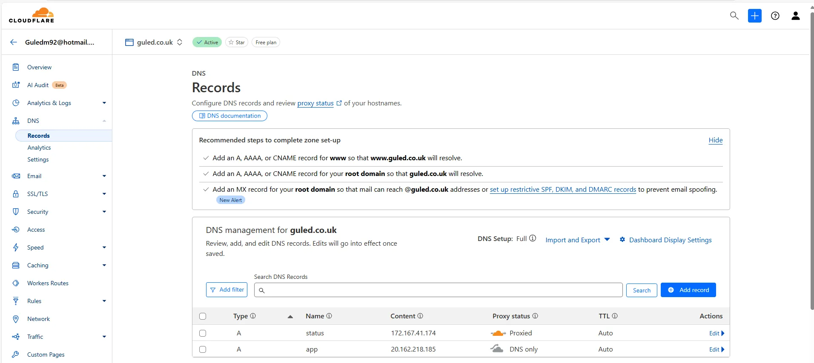
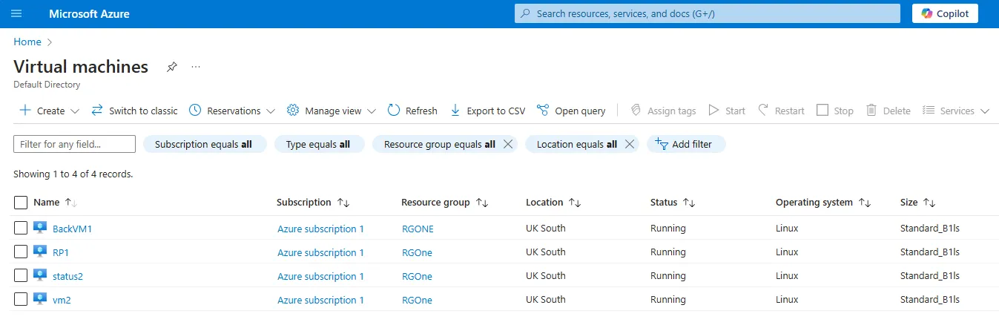
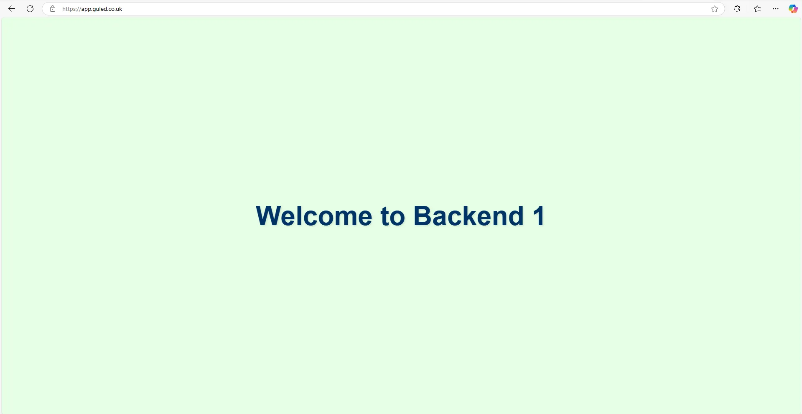
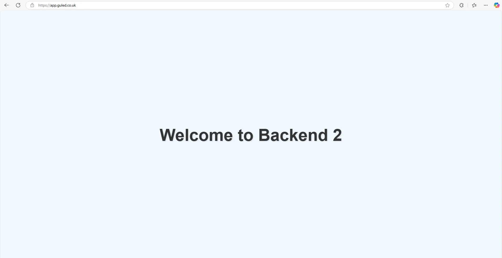
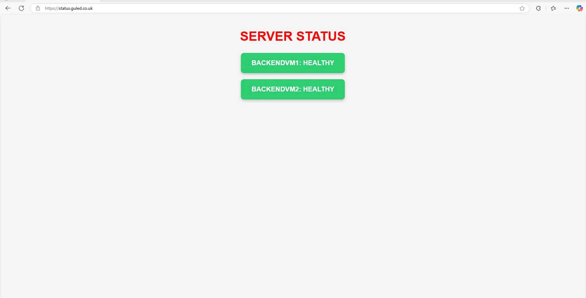

# Azure-Based Load Balanced Web App with Live Status Monitoring

## **Project Breakdown**

### **1. Domain & DNS Setup** 🌍

Using **Cloudflare**, I set up the domain **guled.co.uk** and created two subdomains:

- **app.guled.co.uk** → Routes traffic to the **NGINX reverse proxy (load balancer)**.
- **status.guled.co.uk** → Points to a separate VM hosting a **real-time monitoring page**.

This setup ensures users can access the main app and check server health.




---

### **2. Infrastructure Setup (4 VMs)** 🏗️

I deployed **four virtual machines in Azure**:

- **Backend VM1 (10.0.0.4)**: Runs a simple web page served by **NGINX**.
- **Backend VM2 (10.0.0.6)**: Runs a different page to test load balancing, also served by **NGINX**.
- **Reverse Proxy VM (10.0.0.5)**: Runs **NGINX**, which distributes traffic between backend servers.
- **Status Page VM**: Hosts a status page with a **Bash script for health monitoring**, served by **NGINX**.

This setup ensures **traffic distribution, security, and real-time monitoring**.



### **VM Creation Steps**:

1. **Create VMs in Azure**:
    - Navigate to the **Azure Portal** → **Create a resource** → **Virtual Machine**.
    - Create 4 VMs: Backend VM1(BackVm1), Backend VM2(vm2), Reverse Proxy VM(RP1), and Status Page VM(Status2).
2. **Install and Configure NGINX on Backend VMs**:
On both **Backend VM1** and **Backend VM2**, I installed **NGINX** to serve simple web pages:
    
    ```bash
    
    sudo apt update
    sudo apt install nginx
    sudo systemctl start nginx
    sudo systemctl enable nginx
    
    ```
    
    Then, I modified the default `index.html` on each VM to display unique content for testing purposes:
    
    - Backend VM1: Content: "Welcome to Backend Server 1".
    - Backend VM2: Content: "Welcome to Backend Server 2".

---

### **3. NGINX Reverse Proxy & Load Balancer Configuration** ⚖️

On the **Reverse Proxy VM**, I installed and configured **NGINX** to:

- **Act as a reverse proxy** and route requests to backend VMs.
- **Balance traffic** between **VM1 and VM2**.
- **Automatically detect failures** and redirect traffic to a healthy server.

This setup allows smooth request handling and ensures **high availability**.

### **NGINX Installation on Reverse Proxy VM**:

1. **Install NGINX**:
    
    ```bash
    
    sudo apt update
    sudo apt install nginx
    sudo systemctl start nginx
    sudo systemctl enable nginx
    
    ```
    
2. **Configure NGINX for Load Balancing**:
I edited the NGINX configuration file `/etc/nginx/nginx.conf` to set up load balancing:
    
    ```
    
    http {
        upstream backend {
            server 10.0.0.4;  # Backend VM1 IP
            server 10.0.0.6;  # Backend VM2 IP
        }
    
        server {
            listen 80;
            server_name app.guled.co.uk;
    
            
            }
        }
    }
    
    ```
    
3. **Test and Restart NGINX**:
After editing the configuration, I tested and restarted NGINX:
    
    ```bash
    
    sudo nginx -t
    sudo systemctl restart nginx
    
    ```
    

This configuration ensures **high availability** for the app.

---

### **4. SSL Configuration & Security** 🔐

To secure **app.guled.co.uk**, I:

- Installed an **SSL certificate from Let’s Encrypt** for **HTTPS** encryption.
- Configured **automatic redirection from HTTP to HTTPS**.

### **SSL Installation Using Certbot**:

1. **Install Certbot and NGINX Plugin**:
    
    ```bash
    
    sudo apt update
    sudo apt install certbot python3-certbot-nginx
    
    ```
    
2. **Obtain SSL Certificate**:
I ran the following command to request and install the SSL certificate for `app.guled.co.uk`:
    
    ```bash
    
    sudo certbot --nginx -d app.guled.co.uk
    
    ```
    
    Follow the prompts to verify ownership of the domain. Certbot automatically configures NGINX to use the SSL certificate.
    
    
3. **Restart NGINX to Apply Changes**:
    
    ```bash
    
    sudo systemctl restart nginx
    
    ```
    

This ensures that all communication with `app.guled.co.uk` is encrypted.

---

### **5. Automated Health Monitoring (Bash Script + Cron Jobs)** ⚙️

To track server uptime, I wrote a **Bash script** that:

1. **Pings Backend VM1 and VM2** to check if they are online.
2. Logs the results and updates the **status page** accordingly.
3. Displays:
    - Whether each backend VM is **"Healthy"** or **"Down"**.
    - Which server is currently active.
4. Runs **automatically using cron jobs** at set intervals to update the status page.

### **Health Monitoring Script**:

1. **Create the Health Check Script**:
I created the script `/var/www/html/script.sh` on the **Status Page VM**:

```
#!/bin/bash

# Define the backend servers' IP addresses
VM1="10.0.0.4"
VM2="10.0.0.6"

# Function to ping a server and return health status
ping_server() {
    local server_ip=$1
    local server_name=$2

    # Ping the server and check if it's reachable
    if ping -c 4 $server_ip > /dev/null 2>&1; then
        echo "Healthy"
    else
        echo "Down"
    fi
}

# Get the status of both servers
status_vm1=$(ping_server $VM1 "BackendVM1")
status_vm2=$(ping_server $VM2 "BackendVM2")

# Determine CSS class based on status
status_vm1_class=$(echo "$status_vm1" | grep -q "Healthy" && echo "healthy" || echo "down")
status_vm2_class=$(echo "$status_vm2" | grep -q "Healthy" && echo "healthy" || echo "down")

cat << EOF > /var/www/html/status.html
<!DOCTYPE html>
<html lang="en">
<head>
    <meta charset="UTF-8">
    <meta name="viewport" content="width=device-width, initial-scale=1.0">
    <title>Server Status</title>
    <style>
        body {
            font-family: 'Arial', sans-serif;
            text-align: center;
            background-color: #f4f4f4;
            margin: 0;
            padding: 20px;
        }
        h1 
        {color: red;
            font-size: 42px;
            text-transform: uppercase;
            margin-bottom: 20px;
        }
        .status-container {
            display: flex;
            flex-direction: column;
            align-items: center;
            gap: 20px;
            margin-top: 30px;
        }
        .status-card {
            width: 300px;
            padding: 20px;
            border-radius: 10px;
            box-shadow: 0px 4px 8px rgba(0, 0, 0, 0.2);
            font-size: 22px;
            font-weight: bold;
            text-transform: uppercase;
            display: flex;
            align-items: center;
            justify-content: center;
            transition: transform 0.3s ease-in-out;
        }
        .status-card:hover {
            transform: scale(1.05);
              }
        .healthy {
            background-color: #2ecc71; /* Green */
            color: white;
        }
        .down {
            background-color: #e74c3c; /* Red */
            color: white;
        }
    </style>
</head>
<body>
    <h1>Server Status</h1>
    <div class="status-container">
        <div class="status-card $status_vm1_class">BackendVM1: $status_vm1</div>
        <div class="status-card $status_vm2_class">BackendVM2: $status_vm2</div>
    </div>
</body>
</html>
EOF

echo "Status page updated at: $(date)"
```

1. **Make the Script Executable**:
    
    ```bash
    
    sudo chmod +x /var/www/html/script.sh
    
    ```
    
2. **Schedule the Script to Run Periodically**:
I added a cron job to run the health check every 1 minutes:
    
    ```bash
    
    sudo crontab -e
    
    ```
    
    Add the following line to run the script every 5 minutes:
    
    ```bash
    
    */5 * * * * /var/www/html/script.sh >> /var/log/health_check.log
    
    ```
    
3. **Create the Status Page**:
The **Status Page VM** serves a simple HTML page (e.g., `/var/www/html/index.html`) that displays the results of the health check and the current status.
    
    Example HTML content:
    
    ```
    <!DOCTYPE html>
    <html lang="en">
    <head>
        <meta charset="UTF-8">
        <meta name="viewport" content="width=device-width, initial-scale=1.0">
        <title>Server Status</title>
        <style>
            body {
                font-family: 'Arial', sans-serif;
                text-align: center;
                background-color: #f4f4f4;
                margin: 0;
                padding: 20px;
            }
            h1 {
                color: red;
                font-size: 42px;
                text-transform: uppercase;
                margin-bottom: 20px;
            }
            .status-container {
                display: flex;
                flex-direction: column;
                align-items: center;
                gap: 20px;
                margin-top: 30px;
            }
            .status-container {
                display: flex;
                flex-direction: column;
                align-items: center;
                gap: 20px;
                margin-top: 30px;
            }
            .status-card {
                width: 300px;
                padding: 20px;
                border-radius: 10px;
                box-shadow: 0px 4px 8px rgba(0, 0, 0, 0.2);
                font-size: 22px;
                font-weight: bold;
                text-transform: uppercase;
                display: flex;
                align-items: center;
                justify-content: center;
                transition: transform 0.3s ease-in-out;
            }
            .status-card:hover {
                transform: scale(1.05);
            }
            .healthy {
                background-color: #2ecc71; /* Green */
                color: white;
            }
            .down {
                background-color: #e74c3c; /* Red */
                color: white;
            }
        </style>
    </head>
    <body>
        <h1>Server Status</h1>
        <div class="status-container">
            <div class="status-card healthy">BackendVM1: Healthy</div>
            <div class="status-card healthy">BackendVM2: Healthy</div>
        </div>
    </body>
    </html>
    ```
    

## **Final Thoughts**

This project successfully combined **load balancing**, **SSL security**, and **automated health monitoring** using **cron jobs**. Seeing the system **automatically detect and report failures** was a great learning experience.

### **Key Takeaways & Lessons Learned:**

✅ **Reverse Proxy & Load Balancing:** Setting up Nginx as a reverse proxy was crucial for distributing traffic efficiently and improving redundancy. I gained a deeper understanding of configuring **upstream servers, failover mechanisms.**

✅ **Domain & DNS Management:** Managing domains via **Cloudflare** helped me understand how to properly set up **A records, subdomains, and DNS propagation** to route traffic correctly.

✅ **SSL Security with Let’s Encrypt:** Implementing HTTPS using **Let’s Encrypt** was straightforward but highlighted the need for **automated certificate renewal** using cron jobs.

✅ **Bash Scripting & Automation:** Writing a **Bash script** to ping the backend VMs and updating the status page in real time was a great way to automate monitoring. Using **cron jobs** ensured the script ran periodically without manual intervention.

✅ **Challenges Faced:**

- Initially, I had **misconfigured the Nginx reverse proxy**, causing improper traffic distribution. Fixing this required careful adjustments to the **Nginx config files**.
- SSL setup had a few issues, particularly with **forcing HTTPS redirects**. This was resolved by modifying the Nginx server block.
- Debugging the **cron job** took some time, as I had to ensure the script had the correct **execute permissions** and the proper **absolute paths** for commands.

# **Results**

## https://app.guled.co.uk

**VM1** 



**VM2**



## Status page

### https://status.guled.co.uk

