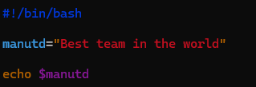
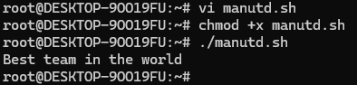

## Variables in Bash Scripting

Variables in Bash scripting are used to store data, like numbers, text, or filenames, which can be used later in the script. Think of variables as containers for values you want to reuse in your script.

## Using Variables

To use the value of a variable, you **prefix its name with a $**.

example below **echo $manutd**

