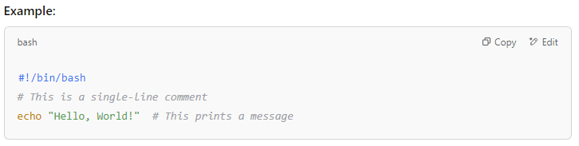

# introduction to Bash Scripting 

Started by creating a new file for my script. Open the terminal and ran the command **touch guled-script.sh**

Ran the vim command to create the script  **vi guled-script.sh**

The first line of every Bash script is the **shebang**

**#!/bin/bash**

Wrote the following commands to the script

**echo "My name is Guled"**

Before you can run the script, I need to make it executable. In the terminal, type:

**chmod +x myscript.sh**

To run the script, I use the following command in the terminal:

**./guled-script.sh**

