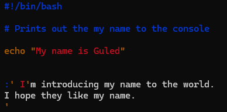
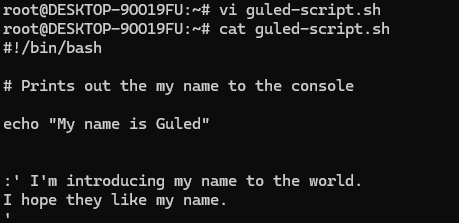

# Add comments to my script

## What is a Comment in Bash Scripting?

A **comment** in Bash scripting is text in your script that is ignored by the Bash interpreter. It’s used to:

- Explain what the script or specific lines of code do.

- Add reminders or notes for yourself or others.

- Temporarily disable code for testing purposes.

:green_circle: Comments do not affect how the script runs.

In the screen shot below you can see I have add a single line comment using the **#**

 **# Prints out the name to the console**

At the bottom of the script you can see I have added a multi line comments where you can add more details about the script which can help the reader. 

**:'I'mtroducing my name to the world.**
**I hope they like my name'**

Here you can see how the comments look when you read the script using the **cat** command.

