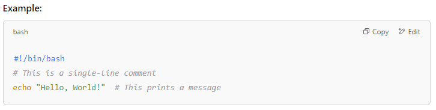
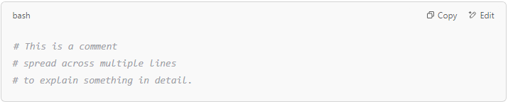

#  Comments in bash scripting

## What is a Comment in Bash Scripting?

A **comment** in Bash is text that is ignored by the interpreter. Comments are used to add notes, explain parts of the script, or temporarily disable code without deleting it. They help make your script easier to read and understand.

## Single-Line Comment in Bash

A single-line comment starts with a # symbol. Everything on the same line after # is ignored by the interpreter.

**Explanation**:

- **#** This is a single-line comment is ignored by Bash.

- The comment after echo "Hello, World!" is also ignored.

## Multi-Line Comments in Bash

Bash doesn’t have a built-in syntax for multi-line comments like some other programming languages. However, you can simulate multi-line comments using:

## 1️⃣ Multiple Single-Line Comments:

You can use # on multiple lines.

