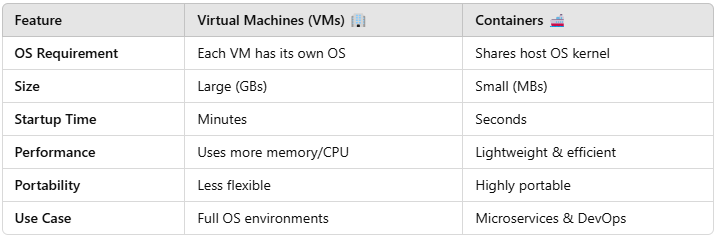

# VMs vs. Containers – What’s the Difference?

Both **Virtual Machines (VMs)** and **Containers** help in running applications efficiently, but they work differently. Let’s break it down!

## 1️⃣ Virtual Machines (VMs) 🏢

A **VM is a full operating system (OS) running on top of another OS** using a **hypervisor** (like VMware, VirtualBox, or Hyper-V).

🔹 Each VM has its **own OS, libraries, and dependencies.**

🔹 Uses a **hypervisor** to manage multiple VMs on a single physical machine.

🔹 **Heavyweight** – Requires more memory and CPU because each VM runs a full OS.

🔹 **Slow startup** – Takes minutes to boot.

💡 **Analogy**: A VM is like renting a **full apartment** — you have everything, but it takes up more space.

## 2️⃣ Containers 🚢

A **Container is a lightweight, isolated environment** that shares the **host OS kernel** instead of running a full OS.

🔹 **Faster & lightweight** – Uses less memory and CPU.

🔹 Starts in **seconds** instead of minutes.

🔹 **Portable** – Runs the same on any system.

🔹 Great for **microservices and cloud-based applications.**

💡 **Analogy:** A container is like living in a shared house—everyone shares the same foundation but has their own space.

## 3️⃣ Key Differences: VMs vs. Containers

## 4️⃣ When to Use What?

✔ **Use VMs** if you need **multiple OS environments** (e.g., running Windows & Linux on the same machine).

✔ **Use Containers** if you want **fast, efficient, and scalable** application deployment.

## Final Thoughts

🚀 **Containers are the future** for cloud, DevOps, and microservices because they are **lightweight, portable, and scalable.** But VMs still have their place for **full OS environments** and legacy applications.