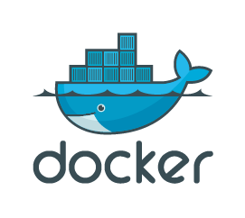

# Docker 🚢

Docker is a **tool that lets you create, run, and manage containers** easily. It helps developers package applications with **everything they need** (code, libraries, dependencies) so they **run the same way everywhere**—on a laptop, server, or cloud.

## Understanding Docker

Docker is the most popular platform for containerisation. It simplifies the process of creating and managing containers. Here's a quick overview of Docker's components:

- **Docker Engine:** The core of Docker, it runs and manages containers.

- **Docker Hub:** A public registry where Docker images can be stored and shared.

- **Dockerfile:** A script that defines how to build a Docker image, specifying the base image, application code, and dependencies.

## Why Use Docker?

✅ **Portability** – Runs on any system without compatibility issues.

✅ **Lightweight** – Uses fewer resources than Virtual Machines (VMs).

✅ **Fast Deployment** – Starts in seconds, making scaling easy.

✅ **Isolation** – Each container runs independently, preventing conflicts.

✅ **DevOps Friendly** – Works great with CI/CD pipelines for automated testing and deployment.

## How Docker Works

1️⃣ **Docker Image** – A template that includes everything needed to run an app.

2️⃣ **Docker Container** – A running instance of an image.

3️⃣ **Docker Hub** – A public repository where you can find and share container images.

