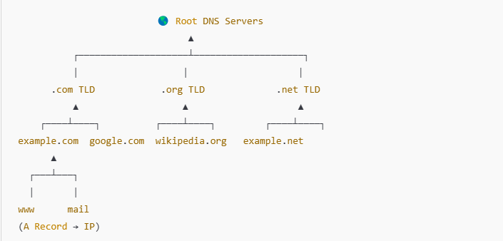

   

## Explanation of the DNS Hierarchy in the Diagram

1️⃣ **Root DNS Servers** – The **starting point** of all DNS lookups, directing queries to the correct TLD server.

2️⃣ **TLD (Top-Level Domain) Servers** – .com, .org, .net, etc. Direct requests to the authoritative nameservers.

3️⃣ **Authoritative DNS Servers** – Store the actual DNS records (A, CNAME, MX) for domains like example.com.

4️⃣ **Subdomains (e.g., www, mail)** – Use A **records** (to map domain names to IP addresses).