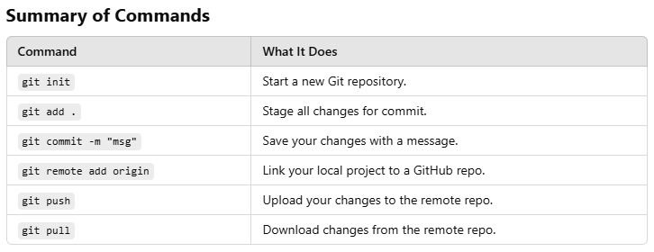

## Step 1: Set Up Git (First Time Only)

Before using Git, you need to configure it.

- Set your username:

**git config --global user.name "Your Name"**

- Set your email:

**git config --global user.email "your.email@example.com"**

## Step 2: Initialize a New Repository

If you’re starting a new project, turn the folder into a Git repository.

- Go to your project folder:

**cd your-project-folder**

- Initialize Git: 

**git init**

## Step 3: Add Files to Your Project

- Add your files:

**git add .**

(This stages all files for commit.)

## Step 4: Save Your Changes (Commit)

- Write a message explaining what you’ve done

**git commit -m "Initial commit"**

## Step 5: Connect to a Remote Repository 

If you want to save your work online (e.g., on GitHub):

- Create a repository on GitHub (do this on the website).

- Link your local repository to GitHub:

**git remote add origin https://github.com/your-username/repository-name.git**

## Step 6: Push Your Code to GitHub

Send your changes to the remote repository.

**git push -u origin main**

## Step 7: Work on Your Project

Edit your files as needed.

Repeat these commands for updates:

Stage changes:  **git add .**

Commit changes: **git commit -m "Describe what you changed"**

Push updates: **git push**

## Optional: Pull Changes (If Working with Others)

If someone else made changes, download them before making your own changes.

- Pull updates from the remote repository:

**git pull**

