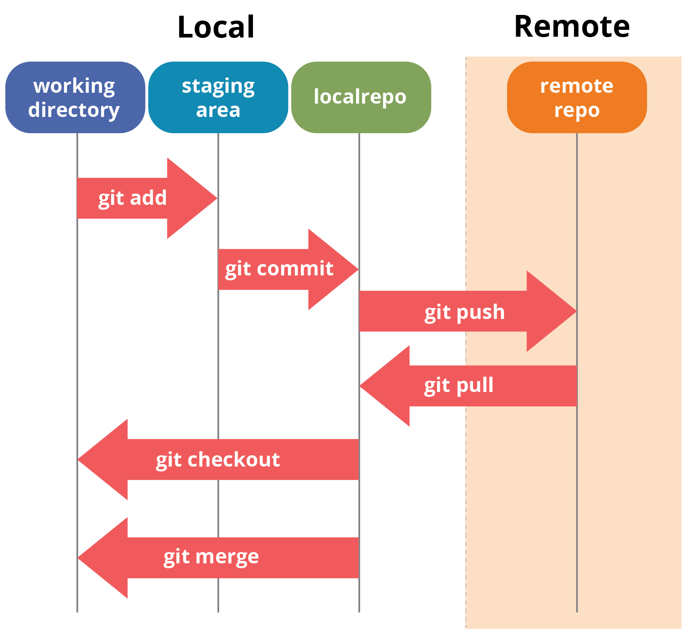

# Example Workflow

- Create or edit files.

- Add files with **git add ..**

- Save changes with **git commit -m "message"**

- Upload with **git push**

This workflow keeps your project safe, organized, and easy to share!

