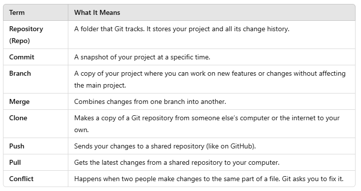

# What is Git? 

Git is a tool that helps you save and manage your work, especially when you’re writing code or working on projects with others. It keeps track of all the changes you make, so you can go back if something breaks or share your work with a team.

## Think of Git Like a Save Button

Imagine you’re writing a book. Every time you make changes, Git takes a snapshot of your work. These snapshots are called commits.

If you ever need to, you can go back to an earlier version of your book (or project).

## Why Use Git?

- **Track Changes**: See what changes you made and when.

- **Backup**: If something goes wrong, you can recover your work.

- **Teamwork**: Share your work with others and combine everyone’s changes easily.

- **Experiment**: Try out new ideas without worrying about messing up your main project.

## Key Git Terms

