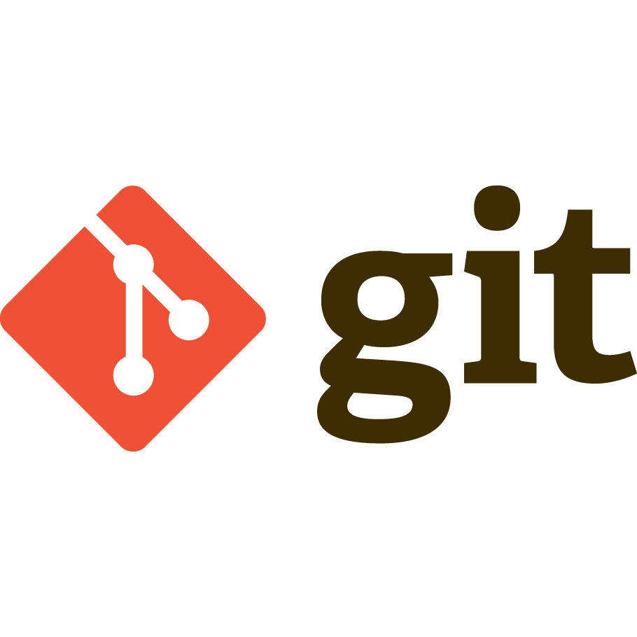

# Git

## What is Git?

Git is a powerful tool that helps you manage changes to your files, especially when you’re working on projects like coding, writing, or design. Think of Git as a way to keep track of all the versions of your work, so you can go back to any point if needed. It’s like having an "undo" button for your entire project.

## Why Do People Use Git?

- **Tracks Changes**: Every time you make changes to your files, Git can save a record of what was changed. This is called a “commit.”

- **Prevents Mistakes**: If you make a mistake, you can easily go back to an earlier version of your project without starting over.

- **Teamwork**: Git lets multiple people work on the same project without messing up each other’s work. Everyone can work on their own part of the project and combine it later.

- **Backup System**: Git stores your work in a safe way, so even if something happens to your computer, your files are saved.

## How Does Git Work?

Here’s a simple explanation:

- **Repository (Repo)**: A Git repository is like a folder where Git tracks your files and changes. You create a repo to start using Git.

- **Staging Area**: Before saving changes, you add them to a “staging area.” This is like preparing your changes before officially saving them.

- **Commit**: A commit is like taking a snapshot of your project at a specific time. It saves the changes so you can revisit them later.

- **Branch**: A branch is a copy of your project. You can create branches to try new things without affecting the main project. Once you’re happy with your changes, you can merge the branch back into the main project.

- **Remote Repositories**: You can save your Git repo online (using platforms like GitHub) so you can share it or access it from anywhere.

## Example to Understand Git:

Imagine you’re writing a book:

- **Repository**: The folder containing all your book files.

- **Commit**: You save changes whenever you finish editing a chapter.

- **Branch**: You create a “branch” to write a new chapter without touching the rest of the book. Once it’s perfect, you add it to the main story.

 - **Remote Repo**: You save your book online to access it from your laptop, tablet, or phone, or share it with others.

## Why is Git Important?

Git is very popular because it:

- Helps developers manage big projects easily.

- Allows teams to work together without conflicts.

- Keeps your work safe and organized.

- Gives you control over every change in your project.

