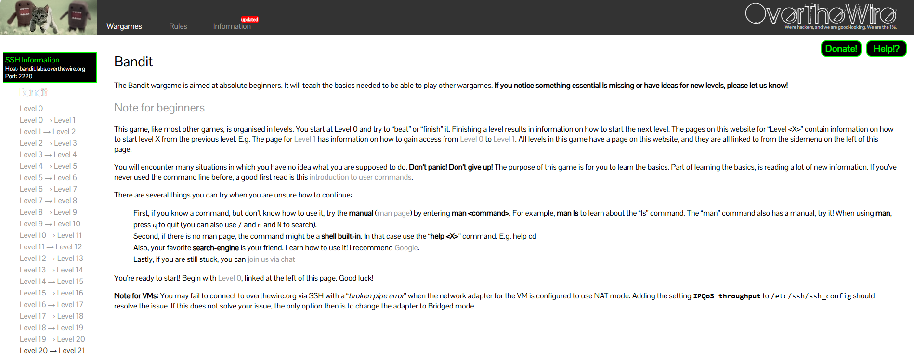

# Over The Wire - Bandit Game

The OverTheWire Bandit game is an online learning tool that teaches basic Linux and hacking skills. You solve puzzles to move to the next level by using simple commands, like finding hidden files or reading text. It’s a fun way to learn how to use the command line and explore computers.

If you want to check it out here https://overthewire.org/wargames/bandit/

