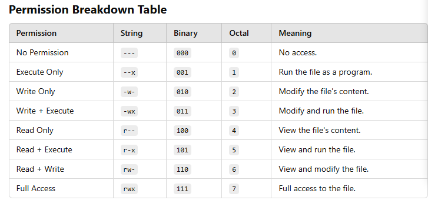
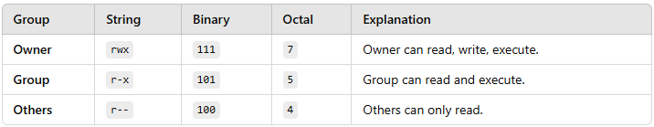
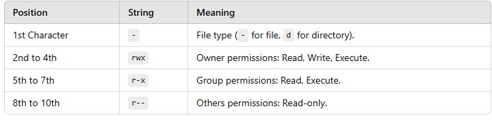
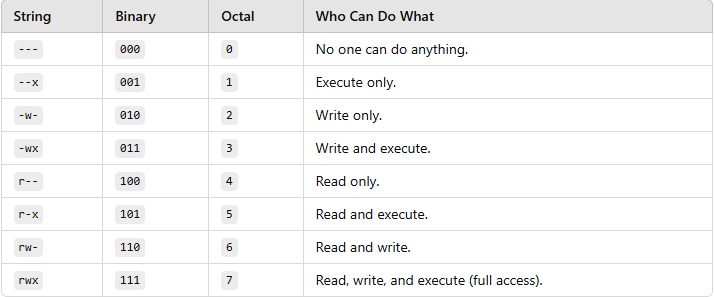

# Understanding Permissions

Each file or directory in Linux has permissions for three categories:

- Owner: The person who owns the file.

- Group: A group of users who share the file.

- Others: Everyone else.

Each category can have read **(r), write (w), and execute (x)** permissions.

# Permission Groups

For every file, permissions are assigned in three groups:

- Owner (the user who owns the file)

- Group (users in the file's group)

- Others (everyone else)

Each group gets its own **String, Binary, and Octal** value.

# Expanded Example: -rwxr-xr--

Let’s analyze this example step-by-step:

## 1️⃣ Breaking Down Each Group

Group	String	Binary	Octal	Explanation
Owner	rwx	111	7	Owner can read, write, execute.
Group	r-x	101	5	Group can read and execute.
Others	r--	100	4	Others can only read.

## 2️⃣ Combine the Octal Values

- Owner: 7

- Group: 5

- Others: 4

- Combined Octal Permission: 754

## 3️⃣ Full Breakdown

## Visual Permission Table

### Here’s a quick reference table for all permissions:

## Real-World Example with Commands

**View Permissions of a File**

- Command: **ls -l filename**

- Output: **-rwxr-xr--**

**Change Permissions with chmod**

- Command: **chmod 754 filename**

- Result: **File permissions are set to rwxr-xr--.**

**Verify Permissions**

- Command: **ls -l filename**

- Output: **-rwxr-xr--.**

By breaking down permissions into **String, Binary, and Octal**, you can understand and manage file access more effectively!

